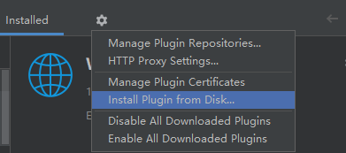

<div align=center>

</div>

<h1 align="center">
  IDEA Web Browser plugin
</h1>

<p align="center">
  <a href="/docs/README_CN.md">中文</a>
</p>

<p align="center">
  Supports rich functions: access configuration homepage, add bookmarks, bookmark management, forward, backward, refresh, etc.
</p>

<p align="center">
  <a href="https://github.com/dbdb8/web-browser-idea-plugin/blob/master/LICENSE"></a>
</p>

<h3 align="center">
  renderings
</h3>
<div align=center>


</div>

## 📸 Online Access

GitHub Pages: <https://github.com/dbdb8/web-browser-idea-plugin>
<br/>

## Download Plugin
<a href="https://github.com/dbdb8/web-browser-idea-plugin/releases/download/1.0-SNAPSHOT/web_browser-1.0-SNAPSHOT.zip" alt="zip plugin">Click to jump to download</a>

**Local installation**

> IDEA > File > Settings > Plugins



Select the downloaded file to install `web_browser-xxx.zip` 

## Project Structure

```

│─build.gradle.kts //gradle Configuration file
└─src
    └─main
        ├─java
        │  └─xyz
        │      └─read1314
        │          └─web_browser
        │              ├─core        //Core function processing
        │              │  ├─entity
        │              │  ├─enums
        │              │  ├─listener
        │              │  ├─renderer
        │              │  ├─service
        │              │  └─util
        │              ├─menu       //Menu event handling
        │              ├─message
        │              └─ui         //UI drawing
        └─resources
            ├─plugin.xml            //Plugin configuration
            └─pluginIcon.svg        //Plugin logo

```


## Rapid Deployment

### IDEA Plugin Development

#### Modify IDEA version 

Modify the `build.gradle.kts` configuration file and change the `IDEA` version number to the version you want to use (only in the development and debugging phase)

```
intellij {
    version '2021.3'
}
```

#### Run Local

> Gradle > Tasks > intellij > runIde


**打包**

> Gradle > Tasks > build > assemble


packaged file
`build/distributions/web_browser-xxx.zip`

