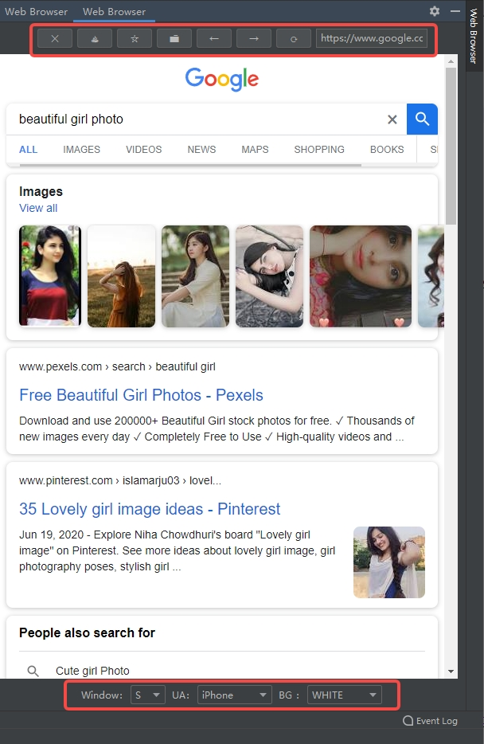

<div align=center>

</div>

<h1 align="center">
  IDEA Web 浏览器插件
</h1>

<p align="center">
  <a href="../README.md">English</a>
</p>

<p align="center">
  支持丰富的功能：访问配置主页、添加书签、书签管理、前进、后退、刷新等。
</p>

<p align="center">
  <a href="https://github.com/dbdb8/web-browser-idea-plugin/blob/master/LICENSE"></a>
</p>

<h3 align="center">
  浏览器插件效果图
</h3>
<div align=center>

</div>

## 📸 在线访问

GitHub Pages: <https://github.com/dbdb8/web-browser-idea-plugin>
<br/>

## 下载插件
<a href="https://github.com/dbdb8/web-browser-idea-plugin/releases/download/1.0-SNAPSHOT/web_browser-1.0-SNAPSHOT.zip" alt="zip plugin">点击跳转下载</a>

**本地安装**

> IDEA > File > Settings > Plugins


选择下载的文件安装 `web_browser-xxx.zip` 

## 项目结构

```

│─build.gradle.kts //gradle配置文件
└─src
    └─main
        ├─java
        │  └─xyz
        │      └─read1314
        │          └─web_browser
        │              ├─core        //核心功能处理
        │              │  ├─entity
        │              │  ├─enums
        │              │  ├─listener
        │              │  ├─renderer
        │              │  ├─service
        │              │  └─util
        │              ├─menu       //菜单事件处理
        │              ├─message
        │              └─ui         //UI绘制
        └─resources
            ├─plugin.xml            //插件配置
            └─pluginIcon.svg        //插件logo

```


## 快速部署

### IDEA插件端

#### 修改IDEA版本 

修改 `build.gradle` 配置文件，将 `IDEA` 版本号改为你想使用的版本（仅限开发调试阶段）

```
intellij {
    version.set("2021.2")
}
```

#### 本地运行

> Gradle > Tasks > intellij > runIde


**打包**

> Gradle > Tasks > build > assemble


打包完成后的文件
`build/distributions/web_browser-xxx.zip`
参照 [插件安装](https://www.jetbrains.com/help/idea/managing-plugins.html#install-plugin-from-zip) 或者 [本地安装](https://www.jetbrains.com/help/idea/managing-plugins.html#install-plugin-from-disk)

